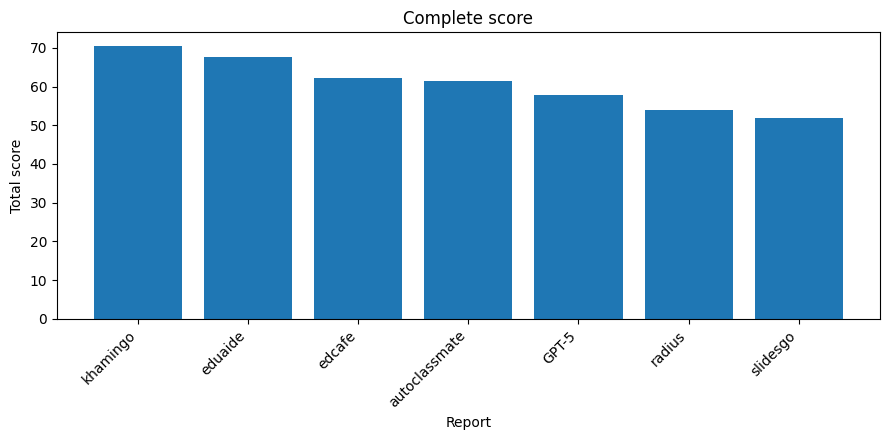
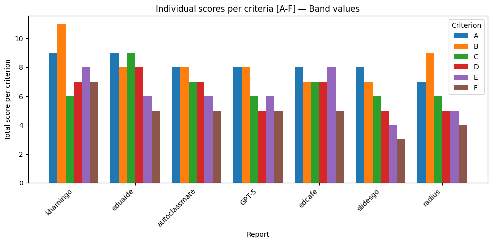
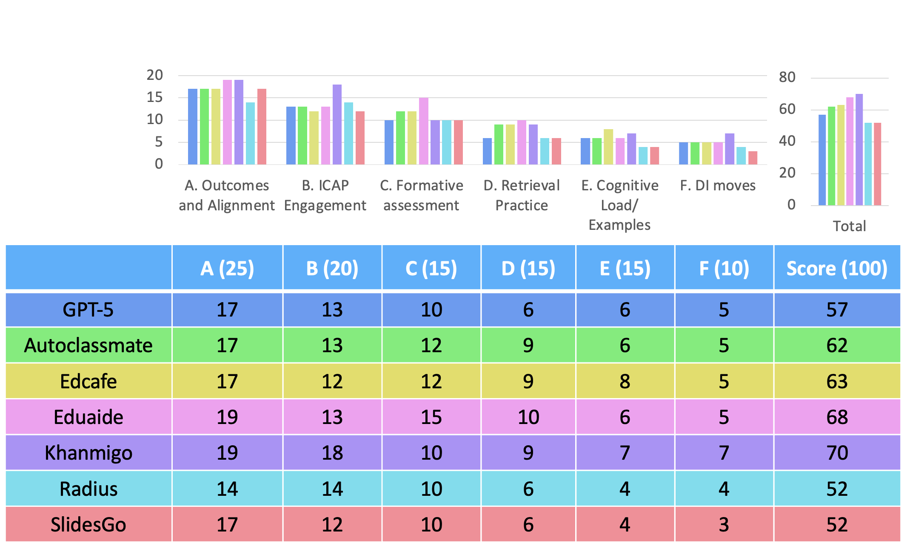

# Comparing AI-Agents for Lesson-Plan Generation


**Quick links**
- [What this repo does](#what-this-repo-does)
- [Why it matters](#why-it-matters)
- [Features](#features)
- [Acronyms (quick)](#acronyms-quick)
- [ULPR at a glance (weights → 100)](#ulpr-at-a-glance-weights--100)
- [Scoring](#scoring)
- [Guardrails / Dependencies](#guardrails--dependencies)
- [Indices (short list)](#indices-short-list)
- [Quick start](#quick-start)

---

## What this repo does
- Evaluates lesson-plan generators (AI agents/LLMs) using a unified rubric (**ULPR**).
- Extracts evidence from lesson text and maps it to **0–4 bands per strand**.
- Outputs reports (**Markdown + JSON**) with strand scores and an overall **0–100**.
- Documents how pedagogy maps to indices used by the evaluator.

## Why it matters
- Most auto-generated lesson plans lack evaluable signals (alignment, **ICAP** engagement, formative use of evidence, retrieval & spacing, **CLT**-aware design).
- **ULPR** gives a research-grounded, replicable way to compare agents/architectures.

## Features
- ✅ **Unified Lesson Plan Rubric (ULPR)** with six strands and weights  
- ✅ **Evidence extraction → banding (0–4) → points (0–100)**  
- ✅ **Markdown and JSON** reports  
- ✅ **Guardrails** (e.g., expertise reversal for CLT) and **dependency caps** (alignment → engagement/formative)

## Acronyms 
- **AI**: Artificial Intelligence  
- **LLM**: Large Language Model  
- **ULPR**: Unified Lesson Plan Rubric  
- **CA**: Constructive Alignment  
- **ICAP**: Interactive–Constructive–Active–Passive (name kept to match manuscript/code)  
- **RP**: Retrieval Practice  
- **DI**: Direct Instruction  
- **CL**: Cognitive Load  
- **SMARTIE**: Specific & Strategic; Measurable; Actionable; Rigorous/Realistic/Results-Focused; Timed; Inclusive; Equity-Oriented  
- **UDL**: Universal Design for Learning

---

## ULPR at a glance (weights → 100)
- **A. Outcomes & Alignment — 25**
- **B. ICAP Engagement — 20**
- **C. Formative Assessment — 15**
- **D. Retrieval Practice — 15**
- **E. Cognitive Load / Examples — 15**
- **F. DI Moves — 10**

## Scoring
- Each index is banded **0–4** with evidence → **points = weight × (band / 4)**.

## Guardrails / Dependencies
- **CLT guardrail:** if `E3 < 2`, any `E1/E2 = 4` → **demote to 3**.  
- **Alignment caps:**  
  - if `A2 ≤ 1` → `B2, C2 ≤ 2`  
  - if `A1 ≤ 1` → `A2 ≤ 2`

---

## Indices (short list)
- **A (Outcomes & Alignment):** A1 SMARTIE outcomes; A2 outcomes↔TLAs↔assessment mapping; A3 structure/timing/flow.  
- **B (ICAP):** B1 time in Constructive+Interactive; B2 generative tasks; B3 all-student routines / structured groupwork.  
- **C (Formative & Retrieval):** C1 retrieval density/effort; C2 formative checks & action; C3 spacing & cumulative coverage.  
- **D (Examples/Scaffolds/Practice):** D1 worked examples; D2 scaffolds & fading; D3 independent practice.  
- **E (Cognitive Load):** E1 intrinsic-load sequencing; E2 extraneous load & modality; E3 expertise adaptation & monitoring.  
- **F (UDL & Accessibility):** F1 multiple means + accessible resources.


---

### 🔎 Indices legend (A1–F2)

- **A1** SMARTIE Outcomes & Success Criteria  
- **A2** Alignment: TLAs ↔ Outcomes ↔ Assessment  
- **A3** Structure, Timing & Flow  
- **B1** ICAP Engagement Mix  
- **B2** Generative Tasks & Prompts  
- **B3** Whole-class Participation & Interactivity  
- **C1** Retrieval Density & Effort  
- **C2** Formative Checks & Actionable Feedback  
- **C3** Spacing, Delayed Checks & Cumulative Coverage  
- **D1** Models/Worked Examples & Guided Practice  
- **D2** Scaffolds & Fading (Generative)  
- **D3** Independent Practice & Monitoring  
- **E1** Intrinsic Load Sequencing  
- **E2** Extraneous Load Minimization & Modality  
- **E3** Expertise Adaptation & Load Monitoring  
- **F1** UDL & Accessibility  
- **F2** Culture of Success & Reflection

---

### 📈 Band scores (0–4 per index) + Weighted Total (0–100)

> **Weighted total** computed by distributing strand weights across subindices:  
> A: 25 (÷3), B: 20 (÷3), C: 15 (÷3), D: 15 (÷3), E: 15 (÷3), F: 10 (÷2).  
> Formula: **points = subweight × (band/4)**; sum across A1–F2.

| Report | A1 | A2 | A3 | B1 | B2 | B3 | C1 | C2 | C3 | D1 | D2 | D3 | E1 | E2 | E3 | F1 | F2 | **Band&nbsp;Sum (max 68)** | **Weighted Total /100** |
|---|---:|---:|---:|---:|---:|---:|---:|---:|---:|---:|---:|---:|---:|---:|---:|---:|---:|---:|---:|
| **GPT-5**        | 3 | 3 | 2 | 3 | 3 | 2 | 2 | 3 | 1 | 2 | 2 | 1 | 2 | 3 | 1 | 3 | 2 | **38** | **57.5** |
| **autoclassmate**| 3 | 3 | 2 | 3 | 3 | 2 | 2 | 3 | 2 | 3 | 2 | 2 | 3 | 2 | 1 | 3 | 2 | **41** | **61.2** |
| **edcafe**       | 3 | 3 | 2 | 2 | 3 | 2 | 2 | 3 | 2 | 3 | 2 | 2 | 3 | 3 | 2 | 3 | 2 | **42** | **62.1** |
| **eduaide**      | 3 | 4 | 2 | 3 | 3 | 2 | 3 | 4 | 2 | 3 | 3 | 2 | 3 | 2 | 1 | 2 | 3 | **45** | **67.1** |
| **khamingo**     | 3 | 4 | 2 | 4 | 3 | 4 | 2 | 3 | 1 | 2 | 3 | 2 | 3 | 4 | 1 | 4 | 3 | **48** | **72.1** |
| **radius**       | 3 | 2 | 2 | 4 | 3 | 2 | 3 | 2 | 1 | 2 | 1 | 2 | 3 | 1 | 1 | 3 | 1 | **36** | **54.6** |
| **slidesgo**     | 3 | 3 | 2 | 2 | 3 | 2 | 2 | 3 | 1 | 2 | 2 | 1 | 2 | 1 | 1 | 2 | 1 | **33** | **50.8** |

---

### 📊 Results

| ULPR comparing all lesson planners' total score | ULPR comparing all lesson planners' per criteria score |
|---|---|
|  |  |
|  |

### 📑 Per-report details (Scores & Evidence)

<details>
<summary><strong>GPT-5 — A1–F2 scores & evidence</strong></summary>

- **A1 — 3**  
  evidence: The lesson plan includes SMARTIE outcomes (define AI literacy, identify various use cases of AI across different industries, and critically analyze the implications of these use cases in real-world contexts) with clear criteria.
- **A2 — 3**  
  evidence: The lesson plan includes alignment between learning objectives (define AI literacy, identify various use cases of AI across different industries, and critically analyze the implications of these use cases in real-world contexts) and assessment tasks (exit ticket + micro-quiz).
- **A3 — 2**  
  evidence: The lesson plan includes a coherent sequence (hook, definitions & scope, group activity, short presentations, class discussion & debrief, wrap-up & assessment) but with minor issues in step design.
- **B1 — 3**  
  evidence: The lesson plan includes a mix of interactive and constructive modes (group activity, short presentations, class discussion & debrief), aiming for 50% C+I with some I.
- **B2 — 3**  
  evidence: The lesson plan includes generative tasks and prompts that require explain/justify/compare/predict (group activity, short presentations, class discussion & debrief).
- **B3 — 2**  
  evidence: The lesson plan includes some whole-class participation and interactivity (quick poll, group activity, short presentations), but with weak interdependence.
- **C1 — 2**  
  evidence: The lesson plan includes one substantial retrieval or mix with low effort (exit ticket + micro-quiz).
- **C2 — 3**  
  evidence: The lesson plan includes aligned exit tickets/mini-quizzes/oral checks with immediate use and task-focused feedback time.
- **C3 — 1**  
  evidence: The lesson plan does not include in-lesson spacing between retrievals or planned delayed cumulative checks (2 days & 1 week).
- **D1 — 2**  
  evidence: The lesson plan includes clear worked examples and specific guided tasks with timing, but no contrasting/common-error example.
- **D2 — 2**  
  evidence: The lesson plan includes specific artifacts attached to tasks (AI Use-Case Canvas), but no explicit plan to fade supports and provoke self-explanation.
- **D3 — 1**  
  evidence: The lesson plan does not include independent tasks that mirror models or a circulation/monitoring plan with error interception.
- **E1 — 2**  
  evidence: The lesson plan includes some segmentation and isolate then integrate, but major topics are still overloaded.
- **E2 — 3**  
  evidence: The lesson plan includes integrated materials (no split-attention) with concise on-screen text and narration aligned with visuals.
- **E3 — 1**  
  evidence: The lesson plan does not include early probe, novices get more guidance, supports fade, or quick effort/load checks (e.g., 1 9) trigger specific adjustments.
- **F1 — 3**  
  evidence: The lesson plan includes multiple means of representation/action/engagement with clear instructions and proactive accommodations (captions/alt text/contrast).
- **F2 — 2**  
  evidence: The lesson plan includes some tracking or brief reflection, but limited link to ILOs.
</details>

<details>
<summary><strong>autoclassmate — A1–F2 scores & evidence</strong></summary>

- **A1 — 3**  
  evidence: The learning objective is clearly stated: “By the end of this lesson, students will be able to define AI literacy, identify various use cases of AI across different industries, and critically analyze the implications of these use cases in real-world contexts.” The outcomes are mostly SMARTIE.
- **A2 — 3**  
  evidence: The lesson plan includes a mix of activities that align with the learning objectives: lecture, group activity, presentations, and class discussion. However, there is no explicit alignment between the outcomes and assessment tasks.
- **A3 — 2**  
  evidence: The lesson plan has a coherent sequence of activities (introduction, lecture, group activity, presentations, and debrief), but some steps are uneven. The timings seem realistic, with buffers between activities.
- **B1 — 3**  
  evidence: The lesson plan includes a mix of Constructive/Interactive modes (lectures, group discussions, presentations) and Passive/Active modes (video clips, handouts). However, there is no explicit aim for 50% C+I with some I.
- **B2 — 3**  
  evidence: The lesson plan includes some targeted generative prompts in key episodes (group activity and presentations), but they are not systematic or tightly aligned to outcomes.
- **B3 — 2**  
  evidence: The lesson plan includes multiple all-student response moments (class discussion and Q&A sessions) and groups have prompts, but the interdependence is weak. There are no clear roles or shared products.
- **C1 — 2**  
  evidence: The lesson plan includes one substantial retrieval opportunity (presentations), but it is not high-effort. There are no distinct retrieval episodes with high-effort formats.
- **C2 — 3**  
  evidence: The lesson plan includes aligned exit tickets/mini-quizzes/oral checks (group activity and presentations), but there is no explicit regroup/reteach plan or scheduled time to apply feedback now.
- **C3 — 2**  
  evidence: The lesson plan includes some spacing between retrievals, but it is not consistent. There are no planned delayed cumulative checks (2 days & 1 week).
- **D1 — 3**  
  evidence: The lesson plan includes full worked examples or think-alouds (lectures and group activity), but there is no explicit timed, scaffolded “we do” phase.
- **D2 — 2**  
  evidence: The lesson plan includes some scaffolds (handouts summarizing key concepts and use cases), but they are not explicitly tied to tasks. There is no clear plan to fade supports and provoke self-explanation.
- **D3 — 2**  
  evidence: The lesson plan includes independent tasks (presentations) that mirror models, but there is no explicit circulation/monitoring plan with error interception.
- **E1 — 3**  
  evidence: The lesson plan has a clear simple→complex progression in the group activity and presentations. However, some topics are still overloaded.
- **E2 — 2**  
  evidence: The lesson plan includes some integrated materials (video clips), but there is no explicit signaling or concise on-screen text. The narration is not aligned with visuals.
- **E3 — 1**  
  evidence: There are no early probes, novices do not get more guidance, and supports do not fade. There are no quick effort/load checks to trigger specific adjustments.
- **F1 — 3**  
  evidence: The lesson plan includes multiple means of representation/action/engagement (video clips, handouts, group discussions), but there is no explicit proactive accommodations for students with disabilities.
- **F2 — 2**  
  evidence: The lesson plan includes some error-friendly norms and progress tracking, but the reflection linked to ILOs informs next steps. There are no structured reflection prompts or evidence that reflection generates conceptual change.
</details>

<details>
<summary><strong>edcafe — A1–F2 scores & evidence</strong></summary>

- **A1 — 3**  
  evidence: The lesson plan includes SMARTIE outcomes (e.g., “Define AI literacy and explain its importance in modern contexts”) and success criteria, with clear aims and inclusivity/equity within outcomes.
- **A2 — 3**  
  evidence: The lesson plan aligns the NY College and Career Readiness Standards (CCRS) with specific learning objectives, indicating a strong match on both content and level across the plan.
- **A3 — 2**  
  evidence: The lesson plan has some coherent sequencing but minor issues; steps are present but uneven. The “Opening Hook” and “Direct Instruction” segments seem well-structured, but the “Guided Practice” and “Independent Practice” segments could benefit from clearer time allocations.
- **B1 — 2**  
  evidence: The lesson plan includes a mix of Constructive/Interactive modes (e.g., think-pair-share, group presentations) but lacks explicit details on the proportion of time allocated to these activities.
- **B2 — 3**  
  evidence: The lesson plan includes generative prompts and tasks that require explain/justify/compare/predict, with rubrics expecting new ideas/links rather than copies. However, the “Independent Practice” segment could benefit from more explicit guidance on how students will engage with these prompts.
- **B3 — 2**  
  evidence: The lesson plan includes some all-student response routines (e.g., think-pair-share) but lacks clear roles and joint products in group work. The “Guided Practice” segment could benefit from more explicit structure.
- **C1 — 2**  
  evidence: The lesson plan includes some retrieval episodes (e.g., the opening hook) but lacks distinct high-effort formats and clear timing for these activities. The “Independent Practice” segment could benefit from more explicit guidance on how students will engage with these tasks.
- **C2 — 3**  
  evidence: The lesson plan includes aligned exit tickets/mini-quizzes/oral checks, but the follow-up actions and feedback plans are not explicitly stated. The “Closing” segment could benefit from more explicit guidance on how students will reflect on their learning.
- **C3 — 2**  
  evidence: The lesson plan includes some spacing between retrievals but lacks clear delayed cumulative checks and prior content revisit. The “Independent Practice” segment could benefit from more explicit guidance on how students will engage with these tasks.
- **D1 — 3**  
  evidence: The lesson plan includes full worked examples or think-alouds in the “Direct Instruction” segment, but the “Guided Practice” and “Independent Practice” segments could benefit from more explicit guidance on how students will engage with these tasks.
- **D2 — 2**  
  evidence: The lesson plan includes some scaffolds (e.g., sentence stems, checklists) but lacks clear plans to fade supports and provoke self-explanation. The “Guided Practice” segment could benefit from more explicit guidance on how students will engage with these tasks.
- **D3 — 2**  
  evidence: The lesson plan includes some independent tasks that mirror models, but the circulation/monitoring plan and error-interception plan are not explicitly stated. The “Independent Practice” segment could benefit from more explicit guidance on how students will engage with these tasks.
- **E1 — 3**  
  evidence: The lesson plan includes a clear simple→complex progression in the “Direct Instruction” segment, but the “Guided Practice” and “Independent Practice” segments could benefit from more explicit guidance on how students will engage with these tasks.
- **E2 — 3**  
  evidence: The lesson plan includes some integrated materials (e.g., visuals, narration) but lacks clear plans for learner pace control and captions. The “Direct Instruction” segment could benefit from more explicit guidance on how students will engage with these materials.
- **E3 — 2**  
  evidence: The lesson plan includes some early probe and differentiated tasks, but the supports fade and quick effort/load checks are not explicitly stated. The “Guided Practice” segment could benefit from more explicit guidance on how students will engage with these tasks.
- **F1 — 3**  
  evidence: The lesson plan includes some multiple means of representation/action/engagement, but the clear instructions and proactive accommodations are not explicitly stated. The “Direct Instruction” segment could benefit from more explicit guidance on how students will engage with these materials.
- **F2 — 2**  
  evidence: The lesson plan includes some error-friendly norms, but the progress tracking and structured reflection linked to ILOs are not explicitly stated. The “Closing” segment could benefit from more explicit guidance on how students will reflect on their learning.
</details>

<details>
<summary><strong>eduaide — A1–F2 scores & evidence</strong></summary>

- **A1 — 3**  
  evidence: The Learning Objectives are clearly stated with measurable verbs (Recall, Apply, Analyze). The outcomes use SMARTIE language.
- **A2 — 4**  
  evidence: Each key ILO has at least one learning activity and one assessment task at the same cognitive level. For example, “Recall key concepts and terminology related to artificial intelligence (AI)” is assessed through an Exit Ticket and a Quick Concept Quiz.
- **A3 — 2**  
  evidence: The lesson plan has some sequencing but with minor issues. The steps are present but uneven, e.g., the Direct Instruction Strategies section jumps between Explicit Instruction and Demonstration without clear transitions.
- **B1 — 3**  
  evidence: The lesson seed aims for a mix of Constructive/Interactive modes (e.g., Think-Pair-Share, Case Study Analysis) with some Interactive activities (e.g., Hands-on Experiment).
- **B2 — 3**  
  evidence: The lesson includes generative prompts and tasks that require explain/justify/compare/predict. For example, the Discussion Prompt asks students to share their prior experiences with AI.
- **B3 — 2**  
  evidence: The lesson plan includes some all-student response routines (e.g., Interactive Class Poll) and group work with prompts. However, the interdependence of groups is weak.
- **C1 — 3**  
  evidence: There are distinct retrieval episodes (e.g., Exit Tickets, Quick Concept Quiz) with high-effort formats (short-answer, no-notes problems).
- **C2 — 4**  
  evidence: The lesson plan includes aligned exit tickets/mini-quizzes/oral checks with immediate use and task-focused feedback time. For example, the Exit Tickets are used to assess understanding of AI literacy.
- **C3 — 2**  
  evidence: There is some spacing between retrievals (e.g., Exit Tickets and Quick Concept Quiz), but no delayed cumulative checks or later quizzes that include prior content.
- **D1 — 3**  
  evidence: The lesson plan includes full worked examples or think-alouds (e.g., the mini-lecture introducing key terms) and a timed, scaffolded “we do” phase (e.g., Guided Practice Worksheet).
- **D2 — 3**  
  evidence: The lesson plan includes sentence stems, checklists, partial solutions, compare-contrast tables (e.g., the Guided Practice Worksheet), and an explicit plan to fade supports.
- **D3 — 2**  
  evidence: The independent tasks mirror models (e.g., Hands-on Experiment), but there is no circulation/monitoring plan with error interception.
- **E1 — 3**  
  evidence: The lesson plan includes a simple→complex progression and isolate hard elements before integration. For example, the Direct Instruction Strategies section starts with Explicit Instruction and then moves to Demonstration.
- **E2 — 2**  
  evidence: There is some integrated materials (e.g., the graphic representation of AI applications in everyday life), but no consistent integration or concise on-screen text.
- **E3 — 1**  
  evidence: The lesson plan does not include early probes, novices getting more guidance, supports fading, or quick effort/load checks to trigger specific adjustments.
- **F1 — 2**  
  evidence: There are some multiple means of representation/action/engagement (e.g., graphic representation of AI applications in everyday life), but no clear instructions or proactive accommodations.
- **F2 — 3**  
  evidence: The lesson plan includes error-friendly norms, progress tracking, and structured reflection linked to ILOs. For example, the Discussion Prompt encourages students to share their prior experiences with AI.
</details>

<details>
<summary><strong>khamingo — A1–F2 scores & evidence</strong></summary>

- **A1 — 3**  
  evidence: The learning objective is clear and specific, with measurable verbs. The student-facing objective is also well-stated. However, the outcomes could be more explicitly linked to the aims.
- **A2 — 4**  
  evidence: Each key ILO has at least one learning activity and one assessment task at the same cognitive level. The activities and assessments mirror the intended performances, with clear alignment between them.
- **A3 — 2**  
  evidence: The lesson plan has a coherent sequence of activities, but there are some minor issues with pacing and timing. Steps are present but uneven.
- **B1 — 4**  
  evidence: The ICAP engagement mix is well-balanced, with 70% C+I and 30% Interactive. The plan also includes credible plans to realize this balance.
- **B2 — 3**  
  evidence: The generative tasks and prompts are frequent and well-framed across episodes, but they could be more tightly aligned to outcomes.
- **B3 — 4**  
  evidence: Whole-class participation and interactivity are high, with all-student response routines and structured group work. Roles and joint products are also clearly defined.
- **C1 — 2**  
  evidence: There are some retrieval opportunities, but they could be more frequent and of higher effort.
- **C2 — 3**  
  evidence: Formative checks and actionable feedback are present, with aligned exit tickets and mini-quizzes. However, the follow-up actions could be more explicitly stated.
- **C3 — 1**  
  evidence: There is no clear spacing between retrievals, and delayed cumulative checks are not planned.
- **D1 — 2**  
  evidence: Worked examples and guided practice are present, but they could be more explicitly tied to the outcomes and with clearer timing.
- **D2 — 3**  
  evidence: Scaffolds and fading are planned, with explicit steps for reducing support. However, the fade-out could be more clearly timed.
- **D3 — 2**  
  evidence: Independent practice mirrors models, but the monitoring plan is not explicitly stated.
- **E1 — 3**  
  evidence: The progression from simple to complex is clear, with some segmentation of hard elements. However, goal-free early tasks are not present.
- **E2 — 4**  
  evidence: Integrated materials and concise on-screen text are used, with narration aligned with visuals. Brief processing pauses are also planned.
- **E3 — 1**  
  evidence: There is no clear early probe or differentiation for novices. Supports do not fade, and quick effort/load checks are not present.
- **F1 — 4**  
  evidence: Multiple means of representation, action, and engagement are provided, with clear instructions and proactive accommodations.
- **F2 — 3**  
  evidence: Error-friendly norms and progress tracking are present. However, structured reflection linked to ILOs is not explicitly stated.
</details>

<details>
<summary><strong>radius — A1–F2 scores & evidence</strong></summary>

- **A1 — 3**  
  evidence: The objectives are clear and specific, using measurable verbs (e.g., “Define AI literacy”, “Identify various use cases of AI”). The outcomes align with the standards.
- **A2 — 2**  
  evidence: Some alignment is visible between activities and assessment tasks. However, not all key ILOs have at least one learning activity and one assessment task at the same cognitive level.
- **A3 — 2**  
  evidence: The lesson plan has a coherent sequence (activate prior knowledge → model → guided → independent), but some minor issues with timing and step design are present.
- **B1 — 4**  
  evidence: The lesson plan aims for 70% C+I with 30% Interactive, which is a good balance of engagement modes. The activities promote active learning and interaction.
- **B2 — 3**  
  evidence: Some targeted generative prompts are present in key episodes (e.g., task cards for analyzing AI use cases). However, not all tasks require explain/justify/compare/predict.
- **B3 — 2**  
  evidence: Multiple all-student response moments are present, but groups have prompts with weak interdependence. Some structured group work is visible, but it could be more explicit and consistent.
- **C1 — 3**  
  evidence: Two retrievals with ~50% high-effort formats are present (e.g., task cards for analyzing AI use cases). However, not all retrieval opportunities have high-effort formats.
- **C2 — 2**  
  evidence: Some aligned exit tickets/mini-quizzes/oral checks are present. However, the follow-up and feedback plan is unclear or missing in some cases.
- **C3 — 1**  
  evidence: No clear spacing between retrievals; no planned delayed cumulative checks (2 days & 1 week).
- **D1 — 2**  
  evidence: Some worked examples or think-alouds are present, but they are not consistently used throughout the lesson. A timed, scaffolded “we do” phase is partially visible.
- **D2 — 1**  
  evidence: Scaffolds like task cards and worksheets are mentioned, but their explicit plan to fade supports and provoke self-explanation is unclear or missing.
- **D3 — 2**  
  evidence: Some independent tasks mirror models, but the circulation/monitoring plan with error interception is not consistently present throughout the lesson.
- **E1 — 3**  
  evidence: A clear simple→complex progression is visible, and some segmentation of hard elements before integration is present. However, goal-free early tasks are not explicitly mentioned.
- **E2 — 1**  
  evidence: Some integrated materials (e.g., task cards) are present, but split-attention and redundant text are still visible in some cases.
- **E3 — 1**  
  evidence: No clear early probe or differentiation plan is present. Supports fade, but the quick effort/load checks (e.g., 1 9) trigger specific adjustments are not explicitly mentioned.
- **F1 — 3**  
  evidence: Some multiple means of representation/action/engagement are visible (e.g., task cards, videos). However, clear instructions and proactive accommodations are not consistently present throughout the lesson.
- **F2 — 1**  
  evidence: No clear error-friendly norms or progress tracking is present. Reflection linked to ILOs informs next steps is partially visible but unclear in some cases.
</details>

<details>
<summary><strong>slidesgo — A1–F2 scores & evidence</strong></summary>

- **A1 — 3**  
  evidence: The lesson plan includes specific outcomes such as “define AI literacy” and “critically analyze the implications of AI technologies”. The objectives are also clearly stated, but there is no explicit mention of inclusivity or equity within the outcomes.
- **A2 — 3**  
  evidence: The learning objectives align with the lesson structure and activities. For example, the “AI Use Cases Exploration” section matches the second objective to identify and explain AI use cases across different industries. However, there is no explicit mention of how these activities will be assessed.
- **A3 — 2**  
  evidence: The lesson structure appears to follow a coherent sequence (activate prior knowledge → model → guided → independent), but the timings are not explicitly stated. The plan mentions “15 minutes” for the introduction, but there is no clear indication of how much time will be spent on each activity.
- **B1 — 2**  
  evidence: The lesson plan includes a mix of interactive and passive activities. The group discussion and presentation evaluation are examples of constructive/interactive modes, but the majority of the time is spent in passive/active mode.
- **B2 — 3**  
  evidence: The lesson plan includes some generative prompts such as “analyze AI applications, benefits, and potential challenges” and “prepare a 5-minute presentation on their findings”. However, the rubrics for these activities are not explicitly stated.
- **B3 — 2**  
  evidence: The lesson plan includes some whole-class participation such as group discussions and presentations. However, there is no explicit mention of how students will be encouraged to participate or how the teacher will monitor their engagement.
- **C1 — 2**  
  evidence: The lesson plan includes some retrieval opportunities such as the group presentation evaluation and individual reflection assignment. However, there is no explicit mention of high-effort formats or distinct retrieval episodes.
- **C2 — 3**  
  evidence: The lesson plan includes some formative checks such as the group presentation evaluation and individual reflection assignment. However, there is no explicit mention of how these results will be used to inform future instruction.
- **C3 — 1**  
  evidence: There is no explicit mention of in-lesson spacing between retrievals or planned delayed cumulative checks.
- **D1 — 2**  
  evidence: The lesson plan mentions “worked examples” and “guided practice”, but there is no clear indication of how these will be implemented or timed.
- **D2 — 2**  
  evidence: The lesson plan includes some scaffolds such as group discussion worksheets, but there is no explicit mention of an explicit plan to fade supports and provoke self-explanation.
- **D3 — 1**  
  evidence: There is no explicit mention of independent tasks that mirror models or a circulation/monitoring plan with error interception.
- **E1 — 2**  
  evidence: The lesson plan mentions “simple→complex progression”, but there is no clear indication of how this will be implemented or if optional goal-free early tasks will be included.
- **E2 — 1**  
  evidence: There is no explicit mention of integrated materials, signaling, concise on-screen text, narration aligned with visuals, or brief processing pauses.
- **E3 — 1**  
  evidence: There is no explicit mention of early probes, novices getting more guidance, supports fading, or quick effort/load checks.
- **F1 — 2**  
  evidence: The lesson plan includes some multiple means of representation/action/engagement such as group discussions and presentations. However, there is no explicit mention of proactive accommodations for students with disabilities.
- **F2 — 1**  
  evidence: There is no explicit mention of error-friendly norms, progress tracking, or structured reflection linked to ILOs.
</details>


## Quick start
- Clone this repo.
- *(Optional)* Create a virtualenv and install deps (e.g., `pip install -r requirements.txt`).
- Run the evaluator on a lesson text file:

```bash
python lesson_plan_evaluator.py \
  --lesson "lessons/lesson_plan(GPT-5).txt" \
  --backend ollama --model llama3.1 \
  --md-out "reports_md/report(GPT-5).md" \
  --json-out "reports_json/report(GPT-5).json"
